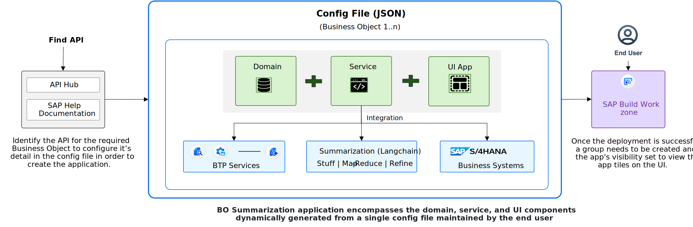
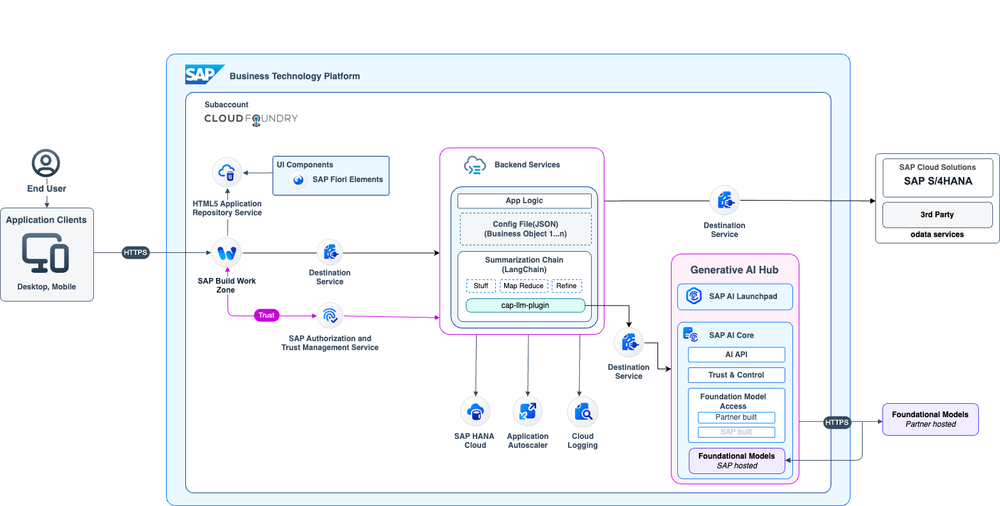
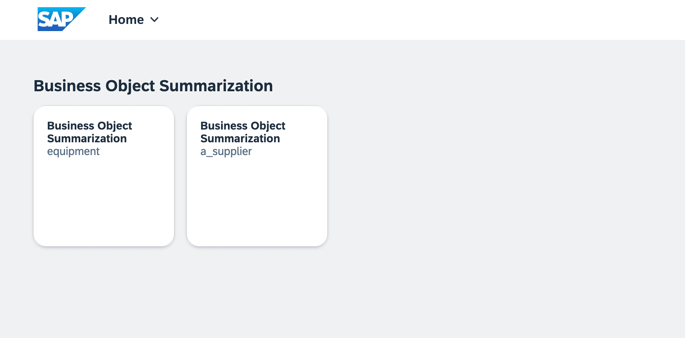
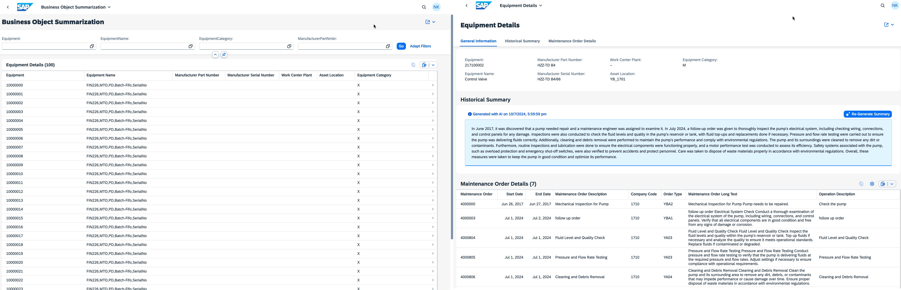
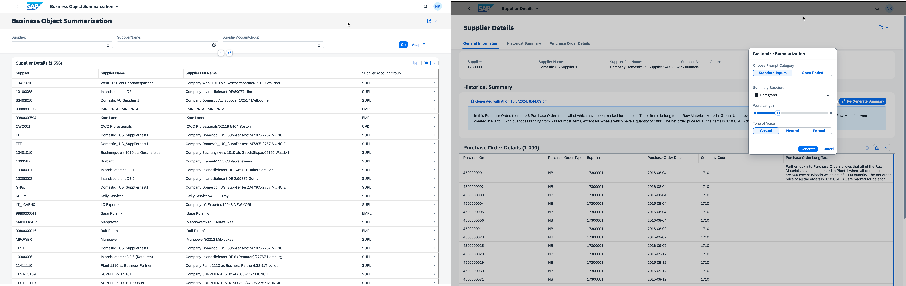
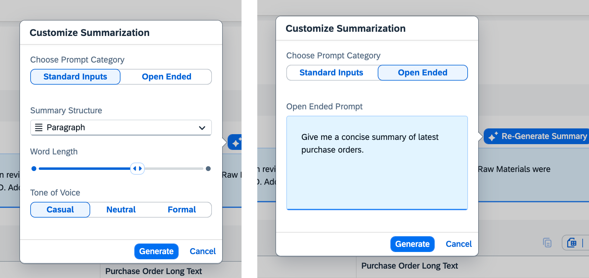

# SAP-samples/repository-template
In the SAP ecosystem, most of us have interacted with Business Objects in one way or another. They are integral to any application created for clients or internal use, providing access to essential business data. However, the conventional process of connecting Business Objects to our applications, especially when performing specific actions on the data, can be tedious and time-consuming. 

This repository ntroduces an innovative architectural approach to dynamically generate application for real time business insights of business objects harnessing the GenAI capabilities in just a few simple steps, significantly reducing the effort and time.
# Containing Files

1. The LICENSE file:
In most cases, the license for SAP sample projects is `Apache 2.0`.

2. The .reuse/dep5 file: 
The [Reuse Tool](https://reuse.software/) must be used for your samples project. You can find the .reuse/dep5 in the project initial. Please replace the parts inside the single angle quotation marks < > by the specific information for your repository.

3. The README.md file (this file):
Please edit this file as it is the primary description file for your project. You can find some placeholder titles for sections below.

# Leveraging Dynamic Application Generation and GenAI for Real-Time Business Insights
In the SAP ecosystem, most of us have interacted with Business Objects in one way or another. They are integral to any application created for clients or internal use, providing access to essential business data. However, the conventional process of connecting Business Objects to our applications, especially when performing specific actions on the data, can be tedious and time-consuming. 

This repository explores an innovative approach to integrating Business Objects harnessing the GenAI capabilities into your applications in just a few simple steps, significantly reducing the effort and time involved while driving business insights.

> **Important Note** : Please be aware that this GitHub repository is still work in progress for improvements and additional scenarios. Make sure you're pulling the repository from time to time and redeploying it in SAP BTP.

<!-- Register repository https://api.reuse.software/register, then add REUSE badge:
 -->

## Table of Contents

[Scenario](#scenario)\
[Solution Overview](#solution-overview)\
[Technical Architecture](#technical-architecture)\
[Requirements](#requirements)\
[Final Demonstartion](#demo)\
[Additional Resources](#additional-resources)\
[Known Issues](#known-issues)\
[Reference](#reference)\
[Disclaimer](#disclaimer)\
[How to Obtain Support](#how-to-obtain-support)\
[Code of Conduct](#codeofconduct)\
[Contributing](#contributing)\
[License](#license)

## Scenario

Imagine you're a business owner managing your operations using SAP, with Business Objects to retrieve and manipulate data across various departments like HR, Suppliers, and more. Each department has its own Business Object, and traditionally, creating separate extension applications for each requires multiple steps—finding the API from the API Hub, creating a Domain, Service, and UI for every Business Object, integrating it with BTP services and S/4HANA systems, and deploying it to SAP Build Work Zone. This repetitive process increases computing resources, development time, and maintenance efforts.

Now, envision a single application that can display and perform actions on any number of Business Objects, regardless of the department. Imagine achieving this with just one configuration file, where you simply provide the details of the necessary Business Objects.

In this repository, we present a proof of concept (PoC) that showcases how to create a single application capable of managing data across multiple Business Objects. This PoC significantly reduces development complexity, providing insights into various master data Business Objects through a simple, one-file deployment.

## Solution Overview

Let us look at the solution overview:

In the above solution overview, let us understand how summarizing Business Objects through a single configuration file works:

1. Configuration File Setup: [objectMappingConfig.json](./srv/config/objectMappingConfig.json)

    - At the initial stage, application developers along with business analysts need to identify and activate the required APIs of the Business Objects for which the latent data or texts needs to be summarized.
    - In the config(json) file, define the bousiness object details (Object Name, API URL, Destination name, search fields, list fields) and settings necessary for the summarization process, including service endpoints, destination etc.

2. Dynamic Application Creation:

    - Using the provided config file, the application dynamically creates an end-to-end setup. This includes setting up the domain model, creating the necessary service layers, and generating the user interface.
    - This approach ensures flexibility and scalability, allowing multiple Business Objects to be summarized simultaneously.

3. Data Summarization:

    - The application processes the latent data from the identified Business Objects based on the details provided in configuration file, transforming it into concise, actionable insights.
    - Langchain's Summarization Chain and it's techniques consisting of Stuff, Map Reduce and Refine are applied to extract the most relevant information as summary.A custom chat model configuration along with cap-llm-plugin is used in langchain to establish the communication to GenAI Hub.

4. Deployment and SAP Build Workzone :

    - Once the deployment is successful, necessary app tile related set up is configured in SAP Build Work Zone to enable role based access for different business users.
    - This step ensures that users can easily access and interact with the application through a user-friendly interface.

## Technical Architecture
Below is a high-level technical architecture:

## Requirements
If not yet done, for this sample application we recommend to set up a **Pay-As-You-Go (PAYG)** or **CPEA** account and use the mentioned **Free (Tier) service plans**. A tutorial how to setup a PAYG account (allowing you to use all Free Tier service plans) can be found in the [Tutorial Navigator](https://developers.sap.com/tutorials/btp-free-tier-account.html). 

| Service                           | Free (Tier)  Plans  |
|-----------------------------------|---------------------|
| [SAP AI Core Service](https://discovery-center.cloud.sap/protected/index.html#/serviceCatalog/sap-ai-core?region=all) | Extended |
| [SAP Application Logging Service](https://discovery-center.cloud.sap/serviceCatalog/application-logging-service/?region=all) | Lite |
| [SAP Authorization and Trust Management Service](https://discovery-center.cloud.sap/serviceCatalog/authorization-and-trust-management-service?region=all&tab=feature)| Application |
| [SAP BTP, Cloud Foundry Runtime](https://discovery-center.cloud.sap/serviceCatalog/cloud-foundry-runtime?region=all) | MEMORY |
| [SAP Build Workzone, standard edition](https://discovery-center.cloud.sap/protected/index.html#/serviceCatalog/sap-build-work-zone-standard-edition?region=all) | Standard |
| [SAP Connectivity Service](https://discovery-center.cloud.sap/serviceCatalog/connectivity-service?region=all) | Lite |
| [Destination Service](https://discovery-center.cloud.sap/serviceCatalog/destination?service_plan=lite&region=all&commercialModel=cloud) | Lite |
| [SAP HTML5 Application Repository Service for SAP BTP](https://discovery-center.cloud.sap/serviceCatalog/html5-application-repository-service?region=all) | App-host |
| [SAP HANA Cloud](https://discovery-center.cloud.sap/serviceCatalog/sap-hana-cloud?tab=customerreference&region=all) | hana-free & tools(Application) |
| [SAP HANA Schemas & HDI Containers](https://help.sap.com/docs/SAP_HANA_PLATFORM/3823b0f33420468ba5f1cf7f59bd6bd9/e28abca91a004683845805efc2bf967c.html?version=2.0.04&locale=en-US) | hdi-shared |

## Demo
Below screenshots for sample scenarios (Plant Maintenance, Purchase Orders):

<i> BO Summarization dashboard for Plant Maintenance for Vessel </i>

<i> BO Summarization dashboard for Purchase Orders </i>

<i> BO Summarization Pop-Over for Standard Input & Open Ended Input </i>

### Demo Video

https://github.com/navyakhurana/business-object-sap/assets/64686397/d3cc3a21-6f0f-4bf5-b0d5-f5a72d9597fc

## How to obtain support
[Create an issue](https://github.com/SAP-samples/<repository-name>/issues) in this repository if you find a bug or have questions about the content.
 
For additional support, [ask a question in SAP Community](https://answers.sap.com/questions/ask.html).

## Contributing
If you wish to contribute code, offer fixes or improvements, please send a pull request. Due to legal reasons, contributors will be asked to accept a DCO when they create the first pull request to this project. This happens in an automated fashion during the submission process. SAP uses [the standard DCO text of the Linux Foundation](https://developercertificate.org/).

## License
Copyright (c) 2024 SAP SE or an SAP affiliate company. All rights reserved. This project is licensed under the Apache Software License, version 2.0 except as noted otherwise in the [LICENSE](LICENSE) file.
